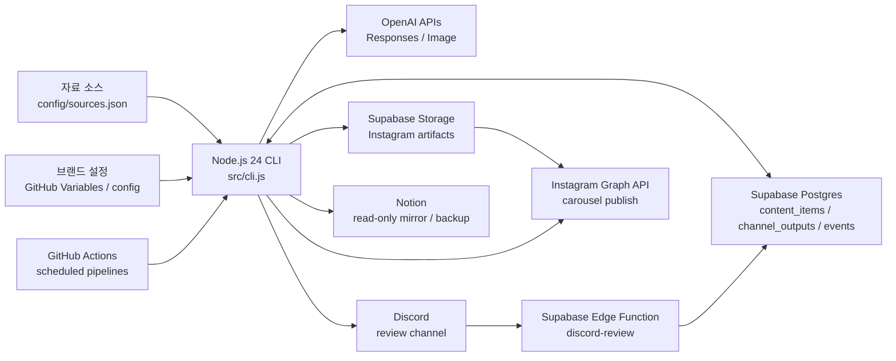
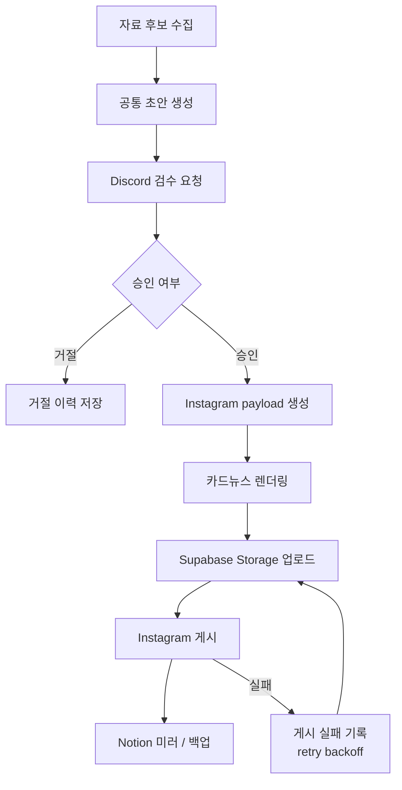
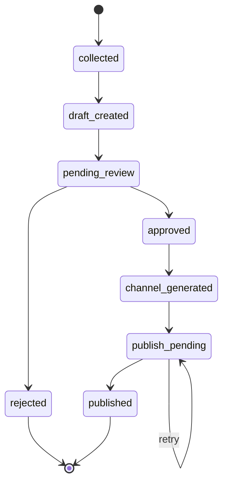
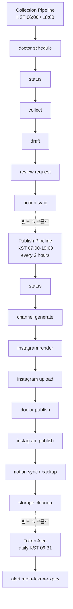

# Brand Pilot

Brand Pilot은 브랜딩/마케팅 자료를 수집하고, OpenAI로 홍보 초안을 만든 뒤, Discord 승인 이후 Instagram 카드뉴스 생성, 게시, Notion 기록까지 이어주는 콘텐츠 자동화 파이프라인입니다.

운영 상태의 기준 저장소는 Supabase Postgres이며, 로컬 검증에는 SQLite fallback을 사용할 수 있습니다. 실행 단위는 Node.js CLI이고, 반복 작업은 GitHub Actions schedule로 구동합니다.

## 핵심 기능

- 지정 자료 소스에서 브랜딩/마케팅 콘텐츠 후보 수집
- OpenAI Responses API 기반 공통 홍보 초안 생성
- Discord 승인/거절 검수
- 승인된 초안을 Instagram 카드뉴스 payload로 변환
- Playwright 기반 Instagram 카드뉴스 렌더링
- Supabase Storage public URL 업로드
- Instagram Graph API 게시
- Notion 읽기용 미러와 산출물 백업
- Meta token 만료 임박 알림
- 게시 실패 기록과 retry backoff

## 시스템 구조



## 콘텐츠 흐름



## 상태 전이



## 운영 파이프라인



## 기술 스택

| 영역 | 사용 기술 |
| --- | --- |
| Runtime | Node.js 24, JavaScript ESM |
| CLI | 자체 Node CLI, `src/cli.js` |
| AI | OpenAI Responses API, OpenAI Image API, JSON Schema structured output |
| Rendering | Playwright Chromium |
| Database | Supabase Postgres, SQLite fallback |
| Storage | Supabase Storage |
| Review | Discord Bot API, Discord Interactions |
| Edge Function | Supabase Edge Function, Deno TypeScript |
| Publishing | Instagram Graph API |
| Mirror | Notion API |
| Automation | GitHub Actions cron, `workflow_dispatch` |

## 프로젝트 구조

```text
src/
  collect/       자료 수집과 HTML 후보 추출
  draft/         공통 초안 prompt, schema, OpenAI 호출
  review/        Discord 검수 메시지와 승인/거절 처리
  channel/       승인 초안의 채널별 payload 변환
  prompts/       Instagram v2 prompt, schema, text-fit 정책
  render/        Instagram 카드뉴스 렌더링
  publish/       Instagram Graph API 게시
  notion/        Notion 미러와 artifact backup
  database/      Supabase / SQLite provider
  storage/       Supabase Storage 연동
  meta/          Meta token 진단
  alert/         token 만료 알림
  cli/           CLI command 구현

docs/             운영, 연동, prompt 관리 문서
supabase/         schema, storage policy, Edge Function
.github/workflows/ GitHub Actions 파이프라인
config/           source, channel, brand 예시 설정
test/             Node test runner 기반 테스트
```

## 문서

- [Supabase Architecture](docs/supabase-architecture.md): 운영 DB, Storage, Edge Function 구조
- [Prompt Map](docs/prompt-map.md): prompt별 수정 위치, schema, 검증 명령
- [Environment Setup](docs/env-setup.md): 로컬 `.env`, GitHub Secrets/Variables 설정
- [Discord Review Setup](docs/discord-review.md): Discord bot과 승인/거절 버튼 처리
- [Meta / Instagram Setup](docs/meta-instagram-setup.md): Instagram 게시용 Meta 설정
- [Notion Mirror](docs/notion-mirror.md): Notion 속성, sync, backup, cleanup
- [Implementation Plan](docs/implementation-plan.md): 구현 단계와 남은 개선 후보

## 로컬 실행

Node.js 24 이상이 필요합니다.

```powershell
npm ci
node --no-warnings=ExperimentalWarning src/cli.js status
node --no-warnings=ExperimentalWarning src/cli.js collect --dry-run --limit 2
node --no-warnings=ExperimentalWarning src/cli.js draft --mock --limit 1
node --no-warnings=ExperimentalWarning src/cli.js review request --mock --limit 1
node --no-warnings=ExperimentalWarning src/cli.js channel generate --mock --limit 1
node --no-warnings=ExperimentalWarning --test
```

실제 API 연동을 검증하려면 `.env.example`을 기준으로 `.env`를 만들고 필요한 값을 채웁니다. 전체 환경 변수와 운영 계정 전환 기준은 [Environment Setup](docs/env-setup.md)에 정리되어 있습니다.

## 주요 CLI

| 명령 | 역할 |
| --- | --- |
| `status` | 현재 저장소 상태와 다음 실행 후보 확인 |
| `collect` | 자료 후보 수집 |
| `draft` | 공통 홍보 초안 생성 |
| `review request` | Discord 검수 요청 전송 |
| `review approve/reject` | 수동 승인/거절 기록 |
| `channel generate` | 승인 초안을 Instagram payload로 변환 |
| `channel regenerate <content-id>` | 기존 채널 산출물 재생성 |
| `instagram render` | Instagram 카드뉴스 파일 렌더링 |
| `instagram upload` | 렌더 산출물을 Supabase Storage에 업로드 |
| `instagram publish` | Instagram Graph API 게시 |
| `notion sync` | Notion 기록 미러 업데이트 |
| `notion backup` | Storage artifact를 Notion-hosted file로 백업 |
| `storage cleanup` | 백업 완료 artifact의 Storage 파일 정리 |
| `doctor schedule/discord/notion/publish` | 운영 설정 진단 |
| `alert meta-token-expiry` | Meta token 만료 임박 알림 |

## 운영 기준

- Collection workflow: `.github/workflows/brand-pilot-schedule.yml`
  - cron: `0 9,21 * * *` UTC
  - KST 06:00, 18:00 실행
  - 수집, 초안 생성, Discord 검수 요청, Notion sync 수행
- Publish workflow: `.github/workflows/brand-pilot-publish.yml`
  - cron: `0 0,2,4,6,8,10,22 * * *` UTC
  - KST 07:00-19:00 사이 2시간 간격 실행
  - 채널 생성, 렌더링, 업로드, 게시, Notion backup, Storage cleanup 수행
- Token alert workflow: `.github/workflows/brand-pilot-token-alert.yml`
  - cron: `31 0 * * *` UTC
  - KST 09:31 실행
  - Meta token 만료 임박 또는 만료 상태를 Discord로 알림

Instagram 실제 게시는 `INSTAGRAM_PUBLISH_ENABLED=true`일 때만 실행됩니다.
